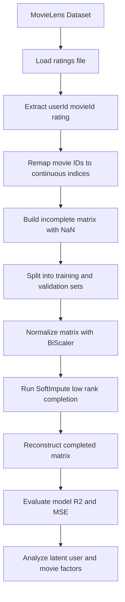

# Collaborative Filtering with SoftImpute – MovieLens Recommender System

This project implements a collaborative filtering model based on **matrix completion** using the well-known **MovieLens** dataset. The goal is to predict missing user–movie ratings by reconstructing a sparse rating matrix through **low-rank approximation**.

Unlike traditional recommendation models (e.g., neighborhood-based methods), this approach learns **latent factors** that summarize user preferences and movie characteristics, allowing the system to infer missing ratings even for items the user has never rated.

This project demonstrates:

- How to process and remap MovieLens data into an incomplete user–item matrix  
- How to normalize sparse matrices for better numerical performance  
- How to apply **SoftImpute**, a state-of-the-art matrix completion algorithm  
- How to extract interpretable latent factors  
- How to evaluate reconstruction quality with **in-sample** and **out-of-sample R²**

---

## Key Results

- **In-sample R²:** 0.6381  
- **Out-of-sample R²:** 0.1932  
- **Movie latent factors:** `(9724 × 4)`  
- **User weights:** `(610 × 4)`  
- **Reconstruction numerical error:** `7.74 × 10⁻¹¹` (virtually perfect reconstruction)

These results indicate that the model captures meaningful structure in the data and successfully reconstructs the matrix, although generalization is moderate — a known challenge with sparse rating data.

---

## System Pipeline

Below is a visual representation of the full workflow—from loading MovieLens to training SoftImpute:

---
### Comparison of Matrix Completion Methods

| Method        | Type                                     | Strengths                                      | Weaknesses                                  |
|---------------|-------------------------------------------|------------------------------------------------|----------------------------------------------|
| SoftImpute    | Convex nuclear norm minimization          | Stable, theoretically grounded, handles sparsity | Slower on huge datasets                      |
| ALS           | Alternating least squares factorization   | Scalable, industry standard (Spark)            | Non-convex, may converge to local minima     |
| SVD           | Linear decomposition                      | Fast, clean, deterministic                     | Cannot handle missing values directly        |
| NMF           | Non-negative matrix factorization         | Highly interpretable latent features           | Requires dense imputation, non-convex        |

### Visual Insights and Interpretation

- The full user–movie matrix is more than 98% sparse, which is typical for real recommender system datasets.  
- The heatmap of missing values confirms that ratings are distributed in a highly irregular, non-uniform pattern across users and movies.  
- Users differ significantly in rating activity: some rate many films, while most rate only a few.  
- Similarly, most movies receive very few ratings, while a small subset accumulates many reviews—an effect similar to a long-tail distribution.  
- The subset heatmap (200 × 200) provides a clearer visual representation of sparsity clusters and helps validate the suitability of matrix completion techniques.  
- These visualizations support the conclusion that SoftImpute is an appropriate model choice, as the dataset exhibits the sparsity and low-rank structure that the algorithm is designed to exploit.
